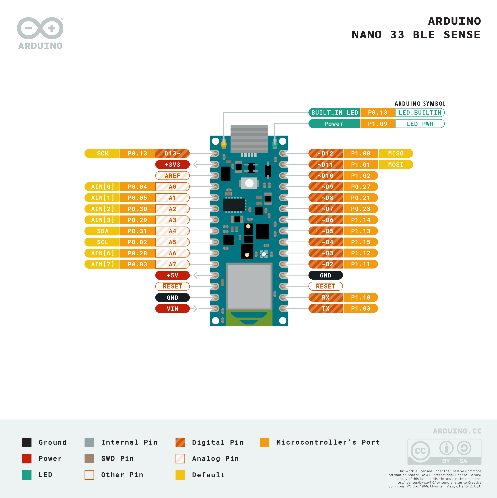

# Arduino Nano 33 BLE WiFi setup

Project demonstrating how to connect an Arduino Nano 33 BLE to Wifi. (Will also work for the Arduino Nano 33 BLE Sense.)

The Arduino Nano 33 BLE does not have WiFi connectivity built-in. An ESP-01 will be connected to the Nano 33 BLE and used as a Wifi module.

 

## Files and Folders

| File/Folder | Description |
|--- | --- |
|  |  |

 

## Branches

**master**: main branch. currently not using other branches.

 

## Circuit Diagram

Wire the components as shown in the diagram.

#### Components Needed
* ESP-01 module and breakout board
* connecting wires
* Arduino Nano 33 BLE

 

 

### Default Pin Wiring

| Pin No | Function |  | Device Connection |
| --- | --- | --- | --- |
|  |  |  |  |
| +3V3 | 3.3V |  | ESP-01 VCC 3.3V |
| GND | GND |  | ESP-01 GND |
| TX | TX |  | ESP-01 RX |
| RX | RX |  | ESP-01 TX |
|  |  |  |  |

 

## ESP-01 Setup

 

## References

- https://github.com/jandrassy/WiFiEspAT