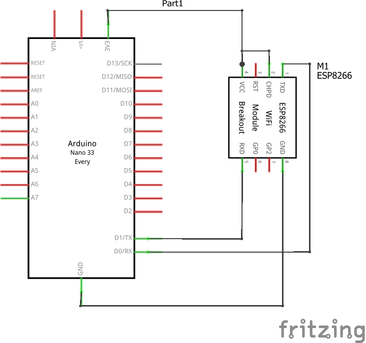
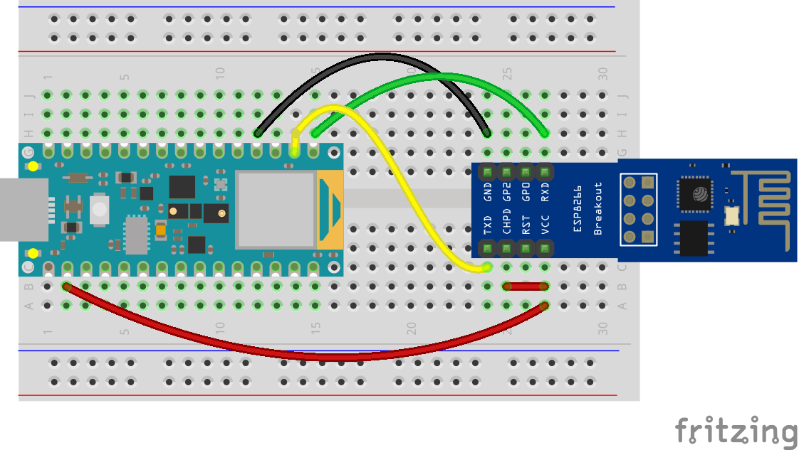

# Arduino Nano 33 BLE WiFi setup

Project demonstrating how to connect an Arduino Nano 33 BLE to Wifi. (Will also work for the Arduino Nano 33 BLE Sense.)

The Arduino Nano 33 BLE does not have WiFi connectivity built-in. An ESP-01 will be connected to the Nano 33 BLE and used as a WiFi module. The [WiFiEspAT](https://github.com/jandrassy/WiFiEspAT) library will be used.

<br />

## Files and Folders

| File/Folder | Description |
|--- | --- |
|  |  |

<br>

## Branches

**master**: main branch. currently not using other branches.

<br>

## Circuit Diagram

Wire the components as shown in the diagram.



#### Components Needed
* ESP-01 module and breakout board
* connecting wires
* Arduino Nano 33 BLE

<br />



<br />

### Default Pin Wiring

| Pin No | Function |  | Device Connection |
| --- | --- | --- | --- |
|  |  |  |  |
| +3V3 | 3.3V |  | ESP-01 VCC 3.3V |
| GND | GND |  | ESP-01 GND |
| TX | TX |  | ESP-01 RX |
| RX | RX |  | ESP-01 TX |
|  |  |  |  |


<br />

## ESP-01 Setup

The ESP-01 needs to have AT firmware version 1.7.x installed. Binaries of the firmware can be downloaded from [Espressif](https://www.espressif.com/en/support/download/at?keys=&field_type_tid%5B%5D=14).

esptool can be used to flash the firmware to the ESP-01.

```bash
python3 -m esptool --chip esp8266 --port COM5 --baud 460800 write_flash --flash_size 1MB 0x0 boot_v1.7.bin 0x01000 at/512+512/user1.1024.new.2.bin 0xfb000 blank.bin 0xfc000 esp_init_data_default_v08.bin 0xfe000 blank.bin 0x7e000 blank.bin
```

More detailed instructions on AT firmware versions is available in the [WiFiEspAT library](https://github.com/jandrassy/WiFiEspAT#at-firmware-versions).

<br />

## References

- https://github.com/jandrassy/WiFiEspAT
- https://www.espressif.com/en/support/download/at?keys=&field_type_tid%5B%5D=14
